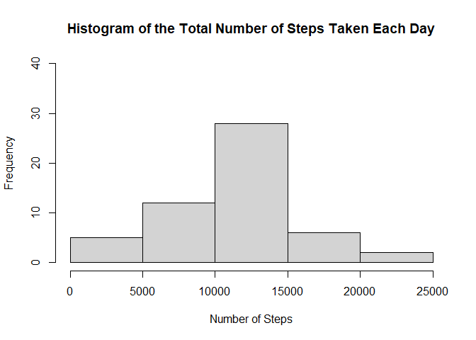

## Loading and preprocessing the data


```r
library(ggplot2)
df <- read.csv(unzip("activity.zip"), na.strings = "NA")
df$date <- as.Date(df$date, "%Y-%m-%d")
```

## What is mean total number of steps taken per day?


```r
pt1 <- aggregate(steps ~ date, df, FUN = sum, na.rm = TRUE)
names(pt1)[2] <- "daily.total.steps"

hist(pt1$daily.total.steps,
     main = "Histogram of the Total Number of Steps Taken Each Day",
     xlab = "Number of Steps", ylim = c(0, 40))
```

<!-- -->

```r
stat1 <- summary(pt1$daily.total.steps)
print(stat1[c(3,4)])
```

```
##   Median     Mean 
## 10765.00 10766.19
```

## What is the average daily activity pattern?


```r
pt2 <- aggregate(steps ~ interval, df, FUN = mean, na.rm = TRUE)
names(pt2)[2] <- "interval.average.steps"

plot(pt2$interval, pt2$interval.average.steps, type = "l",
     main = "Time Series Plot of Average Number of Steps Taken Across Intervals",
     xlab = "5-minute Interval", ylab = "Average Number of Steps")
```

<!-- -->

```r
pt3 <- aggregate(steps ~ interval, df, FUN = max, na.rm = TRUE)
names(pt3)[2] <- "interval.max.steps"
maxint <- pt3$interval[pt3$interval.max.steps == max(pt3$interval.max.steps)]
paste("5-minute interval contains the maximum number of steps:", maxint)
```

```
## [1] "5-minute interval contains the maximum number of steps: 615"
```

## Imputing missing values
### Use mean for that 5-minute interval fill the NA value.


```r
a <- sum(is.na(df$steps))
paste("Total number of missing values in dataset$steps:", a)
```

```
## [1] "Total number of missing values in dataset$steps: 2304"
```

```r
b <- sum(is.na(df$date))
paste("Total number of missing values in dataset$date:", b)
```

```
## [1] "Total number of missing values in dataset$date: 0"
```

```r
c <- sum(is.na(df$interval))
paste("Total number of missing values in dataset$interval:", c)
```

```
## [1] "Total number of missing values in dataset$interval: 0"
```

```r
newdf <- merge(df, pt2, by = "interval", all.x = TRUE)

for (i in 1:dim(newdf)[1]){
    if (is.na(newdf$steps[i])){
        newdf$steps[i] <- newdf$interval.average.steps[i]
    }
}

pt4 <- aggregate(steps ~ date, newdf, FUN = sum)
names(pt4)[2] <- "filled.daily.total.steps"

hist(pt4$filled.daily.total.steps,
     main = "Histogram of the Total Number of Steps Taken Each Day (modified)",
     xlab = "Number of Steps", ylim = c(0, 40))
```

<!-- -->

```r
stat2 <- summary(pt4$filled.daily.total.steps)
print(stat2[c(3,4)])
```

```
##   Median     Mean 
## 10766.19 10766.19
```

## Are there differences in activity patterns between weekdays and weekends?


```r
newdf$weekday <- weekdays(newdf$date) %in% c("Saturday", "Sunday")
newdf$weekday <- as.factor(newdf$weekday)
levels(newdf$weekday) <- c("weekday","weekend")

pt5 <- aggregate(steps ~ weekday + interval, newdf, FUN = mean)
ggplot(data = pt5, aes(x = interval, y = steps)) +
    geom_line() + facet_wrap(~ weekday)
```

<!-- -->
